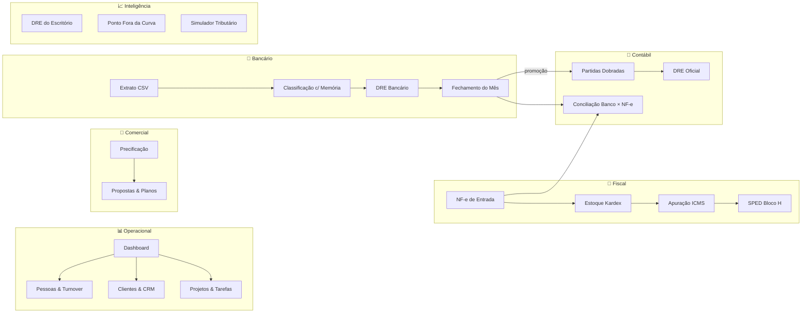
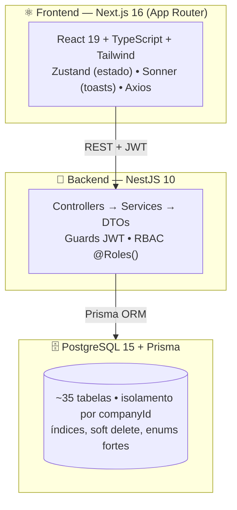

# 🎯 RADAR CONTA CERTA

### O cérebro digital do escritório contábil

<div align="center">


**Um SaaS que transforma 4 horas de trabalho manual em 15 minutos** —
importando extratos e notas fiscais, classificando sozinho, conciliando com inteligência
e entregando DREs prontos para o cliente e para a diretoria.

[Para Diretores](#-resumo-executivo-para-quem-não-programa) •
[Mapa do Sistema](#️-mapa-do-sistema) •
[Jornada das Sprints](#-jornada-de-desenvolvimento-sprints-130) •
[Arquitetura](#️-arquitetura-para-a-equipe-técnica) •
[Roadmap](#️-roadmap-onde-chegamos-e-onde-vamos)

</div>

---

## 📌 Resumo Executivo *(para quem não programa)*

> 💡 **Em uma frase:** o Radar Conta Certa é um sistema na nuvem (SaaS) que
> **automatiza a rotina contábil de ponta a ponta** — do extrato do banco ao relatório
> final do cliente — com segurança, rastreabilidade e inteligência artificial de regras.

### 😫 Antes (como é hoje nos escritórios)

| Atividade | Tempo mensal | Risco |
|---|---|---|
| Digitar extrato bancário planilha por planilha | 2–4 h por cliente | Erros de digitação |
| Classificar cada lançamento "na mão" | 1–2 h por cliente | Inconsistência |
| Conferir Pix × Nota Fiscal olho a olho | 1–3 h por cliente | Pagamentos esquecidos |
| Montar DRE no Excel | 1 h por cliente | Fórmulas quebradas |

### 🤖 Com o Radar Conta Certa

| Atividade | Tempo | Como |
|---|---|---|
| Importar extrato | **10 segundos** | 1 clique no CSV do banco |
| Classificar lançamentos | **automático** | O sistema aprende com o contador |
| Conferir Banco × NF-e | **automático** | Motor de score com confiança % |
| DRE pronto p/ cliente | **1 clique** | Exporta CSV / imprime profissional |

### 🔢 Resultados reais medidos (cliente-piloto: Academia do Renan)

```diff
+ 74 transações importadas e classificadas em segundos (junho/2026)
+ DRE fechado: Receita R$ 9.404,71 × Despesas R$ 10.832,75 (bate com o banco)
+ Julho/2026: 90% classificado SOZINHO pela memória de aprendizado
+ Conciliação Banco × NF-e com sugestões de 80–90% de confiança
```

---

## 🗺️ Mapa do Sistema



---

## ✨ Módulos e Funcionalidades

### 🔐 Segurança & Plataforma
- [x] Login com JWT + refresh token e proteção de rotas
- [x] **Multi-tenant**: cada escritório vê APENAS os seus dados (`companyId`)
- [x] Papéis de acesso (Super Admin, Admin, Gerente, Usuário, Cliente)
- [x] Módulos liberados por plano de assinatura (`allowedModules`)

### 📊 Dashboard Executivo
- [x] KPIs em tempo real (clientes, faturamento, pessoas, metas)
- [x] Gráficos nativos em CSS puro (zero dependências pesadas)

### 👥 Pessoas & Clientes
- [x] CRUD de colaboradores + **Turnover automático** por setor
- [x] Carteira de clientes com honorários, status e ticket médio
- [x] **Importação em massa** da carteira (~100 clientes de uma planilha) sem duplicar

### 💰 Comercial
- [x] Precificação por horas + margem • Planos e propostas com link público
- [x] CRM com funil, motivos de perda e taxa de conversão

### 🧾 Fiscal *(Sprints 8–19)*
- [x] Upload de NF-e em lote com parser próprio de XML
- [x] **Estoque Kardex** com custo médio por replay e saldo inicial importado
- [x] Apuração de ICMS mensal + **SPED Bloco H** (layout legal fixo)
- [x] Relatório H010 com 17 colunas e tributos (ICMS/ST/IPI/PIS/COFINS)
- [x] Manutenção manual de produtos com trilha de auditoria (ajustes)

### 🏦 Bancário *(Sprints 21–24)*
- [x] Importação de extrato CSV com parser à prova de erros (milhares BR/US, datas)
- [x] **Classificação com memória**: o sistema aprende cada correção do contador
- [x] **Naturezas personalizadas por cliente** (cada empresa tem o seu DRE)
- [x] DRE gerencial, relatório por natureza com subtotais, autosoma
- [x] **Fechamento do mês com trava de compliance** (fechou, não mexe)

### 📒 Contábil *(Sprints 20, 25–26)*
- [x] Plano de contas (padrão SCI 90113) + lançamentos de partida dobrada
- [x] **Ponte Bancário → Contábil**: 1 clique transforma o mês em escrituração
- [x] Exportação para o sistema SCI
- [x] **DRE Oficial do Cliente** com confronto Contábil × Bancário

### 🔗 Conciliação Inteligente *(Sprint 29)*
- [x] Motor que cruza **débitos do banco × NF-e de entrada** com score de confiança
- [x] Sugestões 🟢 ≥80% / 🟡 50–79% com revisão humana obrigatória

### 📈 BI & Inteligência
- [x] DRE do Escritório • Ponto Fora da Curva (anomalias estatísticas)
- [x] Simulador Simples Nacional × Presumido × Real • Reforma Tributária (EC 132/23)
- [x] Exportação **PDF profissional** e CSV compatível com Excel (UTF-8 + BOM)

---

## 🏆 O Diferencial: os 3 DREs

| DRE | 🎯 Para quem | 📚 Fonte de dados | 📍 Onde ver |
|---|---|---|---|
| 🏢 **Do Escritório** | Diretor da Conta Certa | Transações financeiras internas | BI |
| 💼 **Bancário do Cliente** | Gestão de caixa do cliente | Extrato + naturezas | Fechamento Mensal |
| 📒 **Oficial do Cliente** | Contabilidade / obrigações | Lançamentos promovidos | BI → DRE do Cliente |

> ✅ Os três conversam entre si por **cards de navegação cruzada**, e o Oficial
> mostra a **diferença em R$** contra o Bancário — auditoria em tempo real.

---

## 🏗️ Arquitetura *(para a equipe técnica)*



### Princípios adotados
1. **Multi-tenant single-database** — um banco, isolamento lógico por `companyId`.
2. **Enums como fonte da verdade** — fim das "strings soltas".
3. **Idempotência por upsert** — importar/promover 2× nunca duplica.
4. **Revisão humana obrigatória** — imports e conciliações nunca aplicam cegamente.
5. **Compliance primeiro** — SPED com layout legal fixo; mês fechado é imutável.
6. **Zero dependências pesadas de gráfico** — CSS puro (‑200 KB de bundle).

---

## 🗄️ Modelo de Dados (tabelas principais)

| Grupo | Tabelas | Destaque |
|---|---|---|
| Plataforma | `Company`, `User` | tenant + RBAC |
| Gestão | `Employee`, `Client`, `ClientContract`, `ClientService` | carteira + contratos |
| Comercial | `Proposal`, `CommercialPlan`, `ServiceItem` | motor de propostas |
| Fiscal | `FiscalInvoice`, `FiscalProduct`, `FiscalInventoryMovement`, `FiscalIcmsApuration` | Kardex + ICMS |
| Contábil | `AccountingAccount`, `AccountingEntry`, `AccountTemplate` | SCI 90113 |
| Bancário | `BankStatement`, `BankTransaction`, `BankCategory`, `BankClassificationRule` | memória de aprendizado |
| Conciliação | `BankNfeMatch` | score + rastreabilidade |
| Operação | `Project`, `Task` | kanban multi-tenant |

---

## 🔌 API (endpoints por módulo)

| Módulo | Principais rotas |
|---|---|
| Auth | `POST /auth/login` • `/auth/register` • `GET /auth/me` |
| Clientes | `GET/POST /clients` • `POST /clients/import` • `GET /clients/metrics` |
| Fiscal | `POST /fiscal/invoices/upload` • `GET /fiscal/inventory/balance` • `GET /fiscal/inventory/compare` • `GET /fiscal/sped` |
| Bancário | `POST /banking/import` • `GET /banking/statement` • `POST /banking/close/:id` • `POST /banking/reopen/:id` |
| Contábil | `POST /accounting/promote-from-banking` • `GET /accounting/dre` • `GET /accounting/export-sci` |
| Conciliação | `POST /banking/reconcile/suggest` • `POST /banking/reconcile/confirm` |
| BI | `GET /bi/dre` • `GET /bi/outliers` • `POST /bi/simulate-tax` |

---

## 📜 Jornada de Desenvolvimento (Sprints 1–30)

| Fase | Sprints | Entrega | Status |
|---|---|---|---|
| 🏗️ Fundação | 1–7 | Auth, Dashboard, Pessoas, Clientes, Precificação, Planejamento, CSV, Toasts | 🟢 |
| 🧾 Fiscal | 8–19 | NF-e, Kardex, ICMS, SPED, H010, unificação de códigos, manutenção c/ auditoria | 🟢 |
| 📒 Contábil | 20 | Plano de contas SCI, lançamentos, conciliação, base histórica | 🟢 |
| 🏦 Bancário | 21–24 | Extrato, classificação c/ memória, naturezas por cliente, fechamento c/ trava | 🟢 |
| 🔗 Integração | 25–26 | Ponte Bancário→Contábil, DRE Oficial, autocomplete de contas | 🟢 |
| 🎨 UX | 27–28 | Menu em 7 seções, nomenclatura dos 3 DREs, navegação cruzada | 🟢 |
| 🤖 Inteligência | 29 | Conciliação Banco × NF-e com motor de score | 🟢 |
| 📚 Documentação | 30 | README executivo + técnico (este arquivo) | 🟢 |

### 🔧 Decisões técnicas que salvaram o produto (ADR-resumo)
- **Parser por conteúdo, não por cabeçalho** → aceita qualquer CSV de banco.
- **Datas pela máscara** → `01/06/2026` (BR) vs `6/1/26` (pivot) sem ambiguidade.
- **Memória por contraparte normalizada** → "CEEE" casa com "Ceee Distribuicao".
- **Upsert `(companyId, code)`** → criar a conta PAGBANK 2× não gera erro.
- **Classificação do DRE pelo sinal da transação** → independente do plano de contas.
- **Estorno por replay no Kardex** → excluir NF-e recalcula custo médio corretamente.

---

## 🚀 Instalação (3 passos)

```bash
# 1) Backend
cd backend && npm i && cp .env.example .env
npx prisma migrate deploy && npx prisma generate && npm run start:dev   # → :3001

# 2) Frontend
cd frontend && npm i && cp .env.example .env.local
npm run dev                                                              # → :3000

# 3) Acessar http://localhost:3000 e entrar com o usuário admin do seed
```

---

## 🎨 Identidade Visual

| 🟩 Teal `#0d9488` | 🟧 Laranja `#f97316` | ⬜ Cinza `#475569` |
|---|---|---|
| Cor primária (ações, sidebar) | Destaques e alertas | Textos neutros |

---

## 🗺️ Roadmap — onde chegamos e onde vamos

```diff
✅ FASES 1–2.5  Fundação + BI + Fiscal + Bancário + Contábil (Sprints 1–30)
!  FASE 3 — PRODUÇÃO (próxima)
   + Sprint 31 · Docker + docker-compose (deploy em 1 comando)
   + Sprint 32 · Deploy em nuvem/VPS com proxy reverso
   + Sprint 33 · CI/CD (GitHub Actions)
   + Sprint 34 · Monitoramento (Sentry) + Backup automático
!  FASE 4 — EXPANSÃO
   + Relatórios PDF em todos os módulos
   + Portal do Cliente (login CLIENTE)
   + Consolidação multi-cliente (visão do escritório)
   + Integrações eSocial / Sintegra • App mobile • White-label
```

---

## 📖 Glossário *(para a diretoria)*

| Termo | Significado simples |
|---|---|
| **SaaS** | Software assinado e usado pela internet, sem instalar nada |
| **Multi-tenant** | Vários escritórios no mesmo sistema, cada um vendo só o que é seu |
| **DRE** | "Demonstração de Resultado" — o boletim de notas financeiro do mês |
| **NF-e** | Nota Fiscal eletrônica (o XML oficial emitido/comprado) |
| **Kardex** | O "extrato do estoque": tudo que entrou, saiu e o custo médio |
| **SPED** | Arquivo oficial exigido pela Receita Federal |
| **Partidas dobradas** | Regra contábil: todo débito tem um crédito igual |
| **Conciliação** | Conferir se o que saiu no banco bate com a nota fiscal |
| **Score** | Nota de confiança (0–100%) que o motor dá a cada sugestão |

---

## 🤝 Licença & Autor

> **Proprietary License** — Copyright © 2026 **Conta Certa Soluções Empresariais**.
> Propriedade intelectual; cópia ou distribuição sem autorização são proibidas.

**👨‍💻 Autor:** Marcos — Desenvolvedor Full Stack
**Stack:** Next.js 16 • NestJS 10 • PostgreSQL • Prisma • Tailwind
**📞 Suporte:** contato@contacerta.com.br • www.contacerta.com.br

<div align="center">

### Feito com ❤️ para transformar a contabilidade brasileira
⭐ Útil para você? Dê uma estrela no repositório!

</div>